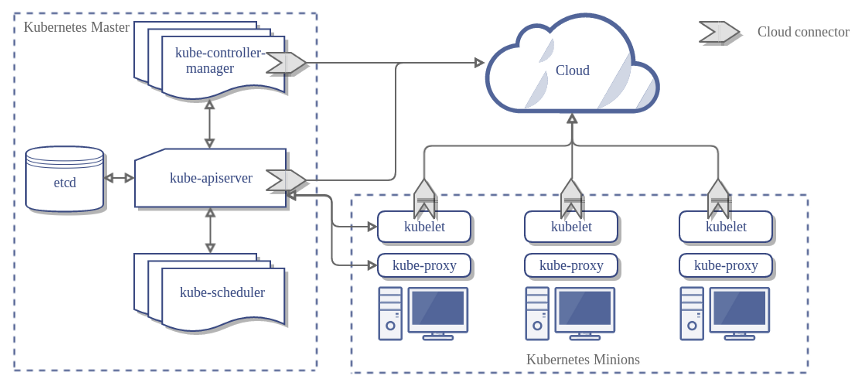
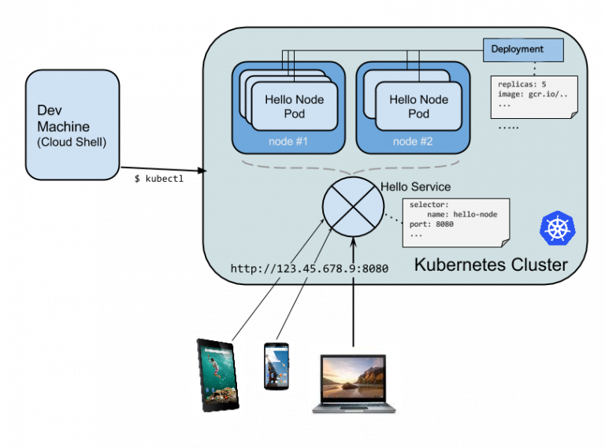

# Kubernetes
Kubernetes 是由 Google 所開源的一套 Container Cluster 系統，可以兼容於 docker 與 rkt 等 container 系統，提供一套跨雲的 Container 解決方案。透過 Kubernetes，讓使用者可以輕鬆建置自己的雲端 orchestration，並且可以遨遊在公有雲、私有雲以及自建的本地端環境中，而不用擔心被雲服務不同的 API 所限制。

## Docker vs. VM
Docker 的輕量虛擬化的技術及易於移植的特性，非常利於現代雲端服務的開發及部署。相對來說，傳統的虛擬機需要追求高規格，且在基礎設施和維運 (Ops) 上需要花費非常多的工夫和心力。以下是傳統虛擬機器與 Docker 容器所做的比較：

|               | Docker 容器                           | 傳統 VM                                       |
|---------------|---------------------------------------|-----------------------------------------------|
| 虛擬化技術    | 以應用程式為中心                      | 以作業系統為中心                              |
| 安裝作業系統  | 不需要，故啟動快                      | 需要，故啟動慢                                |
| 標準化        | 利用 Docker 映像檔便可輕易複製開發環境| 各家標準不同，作業系統核心也不一樣，移植困難  |
| 對於 DevOps   | 完整的紀錄下來並結合版本控制CI/CD工具 | 整合 DevOps 工具相對困難                      |

## Monolithic-service vs. Microservice
微服務 (microservices) 架構將每一個具有商業邏輯的服務獨立出來，例如不再將所有資料都寫入同一個資料庫，而是每個單獨的服務都有一個最適合自己本身結構的資料庫。好處是讓每個服務都可以用最適合自己的語言、資料庫來開發。從下圖可以看到，乘客管理、Web UI、金流等都是一個獨立出來的微服務，而每個服務都開放了REST API實行客戶端或者服務之間的溝通。在實作上，每一個商業功能/服務都可能是一台 VM 或者一個容器。

## K8S and microservice
Kubernetes 特別適合微服務這樣的架構。將數個容器組合起來成一個服務 (Service，註：Service 是 K8S 的專有名詞，下面會介紹)，Kubernetes 也提供了良好的服務發現 (Service discovery) 機制，讓每個服務彼此可以通信。最重要的是 K8S 強大的編程可以自動擴展服務，甚至還可以對大規模的容器作滾動更新 (Rolling update) 以及回滾機制 (Rolling back/Undo)，更可以整合 CI/CD 等 DevOps 的工具，絕對讓您用最小的力氣管理最龐大的系統。

## Kubernetes architecture
Using kubernetes with [Google Container Engine (GKE)](https://cloud.google.com/container-engine/docs/).

K8S 屬分布式系統，主要元件有：

Master – 大總管，可做為主節點

Node – 主要工作的節點，上面運行了許多容器。可想作一台虛擬機。K8S 可操控高達 1,000 個 nodes 以上

Masters 和 Nodes 組成叢集 (Clusters)

Master 包含了三個基本組件 Etcd, API Server, Controller Manager Server。

Server Node 包含了四個基本組件 Kubelet, Proxy, Pod, Container。

Kubernates Cloud Controller Manager (CCM) 標準的架構圖，主要說明透過  Google Cloud 運作 K8s 的架構，對於自己透過實體機或 VM 架設整個 K8s Cluster 概念也是一樣的。

Kubelet 安裝於每一個 Node 上，負責與 API Server 溝通，也包含初始化並且將自己納入到整個 Cloud Cluster 的管理，Kubelet 就像是 Node 上面的 Docker 代理人，負責管理自己所分派的 Container。

etcd 是一個分散式資料庫系統，由於我們的 Master Node 可以由多個節點組成，好讓某個節點發生故障的時候可以有其他 Master Node 接手管理 Container，因次透過 etcd 會隨時同步每一個 Master Node 的資料。

## Pod
* 容器是位於 pod 內部，一個 pod 包覆著一個以上的容器，這造成 K8S 與一般容器不同的操作概念
* 在 Docker 裡，Docker container 是最小單位，但在 K8S 可想作 pod 為最小單位
* Pod 擁有不確定的生命週期，這意味著您不曉得任一 pod 是否會永久保留
* Pod 內有一個讓所有 container 共用的 Volume，這會與 Docker 不同
* Pod 採取 shared IP，內部所有的容器皆使用同一個 Pod IP，這也與 Docker 不同
* Pod 內的眾多容器都會和 Pod 同生共死，就像桃園三結義一樣！

## Service
* 每個 Service 包含著一個以上的 pod
* 每個 Service 有個獨立且固定的 IP 地址 – Cluster IP
* 客戶端訪問 Service 時，會經由上述提過的 proxy 來達到負載平衡、與各 pod 連結的結果
* 利用標籤選擇器 (Label Selector)，聰明地選擇那些已貼上標籤的 pod

## Deployments
* 舊版的 K8S 使用了副本控制器 (Replication Controller) 的名詞，在新版已經改成 Deployments
* Deployments 顧名思義掌控了部署 Kubernetes 服務的一切。它主要掌管了 Replica Set 的個數，而 Replica Set 的組成就是一個以上的 Pod
* Deployments 的設定檔可以指定 replica，並保證在該 replica 的數量運作
* Deployments 會檢查 pod 的狀態
* Deployments 下可執行滾動更新或者回滾

## miniKube: 單機版的Kubernetes
[miniKube](https://github.com/kubernetes/minikube) 是Google 發布可以在單機上面跑 Kubernetes 的工具，安裝跟使用都相當簡單．由於會在本地跑一個 VM ，所以也不用擔心會被 Google Cloud 不小心付費的問題。
Tutorial: [http://www.evanlin.com/Learn-about-kubernetes/](http://www.evanlin.com/Learn-about-kubernetes/)

## Learn Kubernetes through Google Compute Engine (Google Cloud)
[http://www.evanlin.com/Learn-about-kubernetes-2/](http://www.evanlin.com/Learn-about-kubernetes-2/)

## 主要功能
* 將多台 Docker 主機抽象為一個資源，以集群方式管理容器，包括任務調度、資源管理、彈性伸縮、滾動升級等功能。
* 使用編排系統 (YAML File) 快速構建容器集群，提供負載均衡，解決容器直接關聯及通信問題。
* 自動管理和修復容器，簡單說，比如創建一個集群，裡面有十個容器，如果某個容器異常關閉，那麼，會嘗試重啟或重新分配容器，始終保證會有十個容器在運行，反而殺死多餘的。

## 運作方式
Kubernetes 最主要的三個構成要素，分別是 Pod、Replication Controller (RC) 與 Service。Kubernetes 主要的控制核心是 RC，可以根據設定去控管 Pod 的運作，而每個 Pod 可以存放一個或多個容器。當使用者發出請求時，這些請求會經過 Service 進行負載平衡，根據分配演算法分至不同的 Pod 存取資源。
* Pod：Kubernetes的最小單位，每個Pod可以放置一個或多個容器
* Replication controller：管理Pod的控制器，讓指定數量的Pod 能同時順利執行
* Service：對外的窗口，其實就是一個負載平衡器，將外部流量導向至Pod

## Kubernetes 安裝
K8s Cluster 安裝分幾種選擇：
* 全自動 (GKE): Master / Worker Nodes 安裝都不用管，連升級 K8s 版本都不用管
* 自動 (EKS): Master Node 由 AWS 管理，使用者自行用 CloudFormation 管理 Worker Nodes
* 半自動 (kops): Master / Worker Nodes 都自己裝，除了這些，也包含網路規劃、權限等
* 半手動 (kubeadm): 從 VM / Machine 開始就要自己來
* 全手動: 全都自己來

## References
[K8s 架構介紹](https://blog.toright.com/posts/6416/kubernetes-intro.html)

[Kubernetes 元件介紹與 minikube 安裝教學](https://blog.toright.com/posts/6513/kubernetes-%E5%9F%BA%E7%A4%8E%E5%85%83%E4%BB%B6%E4%BB%8B%E7%B4%B9%E8%88%87minikube%E5%AE%89%E8%A3%9D.html)

[Kubernetes Playground](https://www.katacoda.com/courses/kubernetes/playground)

[Kubernetes Lab](https://kubernetes.io/docs/tutorials/kubernetes-basics/create-cluster/cluster-interactive/)

[為什麼使用 Kubernetes](https://blog.gcp.expert/kubernetes-gke-introduction/)
