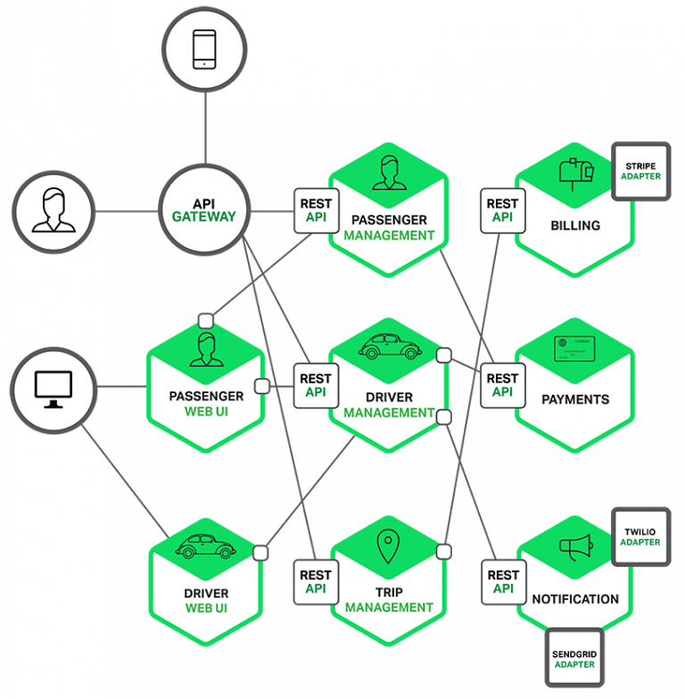
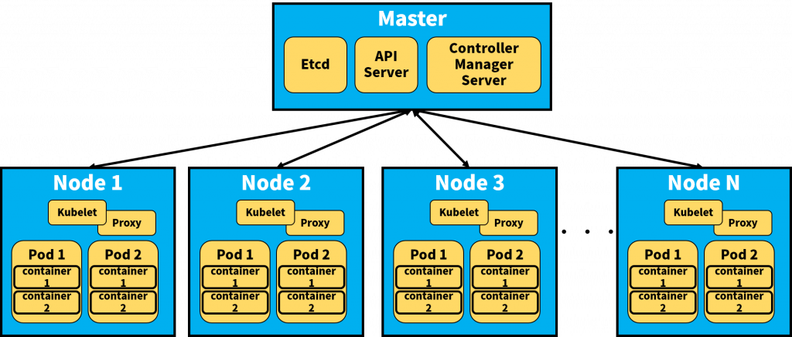

# Kubernetes
## Docker vs. VM
Docker的輕量虛擬化的技術及易於移植的特性，非常利於現代雲端服務的開發及部署。相對來說，傳統的虛擬機需要追求高規格，且在基礎設施和維運(Ops)上需要花費非常多的工夫和心力。以下是傳統虛擬機器與Docker容器所做的比較[1]：
Docker容器	傳統VM
虛擬化技術	以應用程式為中心	以作業系統為中心
安裝作業系統	不需要，故啟動快	需要，故啟動慢
標準化	利用Docker映像檔便可輕易複製開發環境	各家標準不同，作業系統核心也不一樣，移植困難
對DevOps的作用	Dockerfile將參數、環境完整的紀錄下來並結合版本控制CI/CD工具	整合DevOps工具相對困難

## Monolithic-service vs. Microservice
微服務(microservices)架構將每一個具有商業邏輯的服務獨立出來，例如不再將所有資料都寫入同一個資料庫，而是每個單獨的服務都有一個最適合自己本身結構的資料庫。好處是讓每個服務都可以用最適合自己的語言、資料庫來開發。從下圖可以看到，乘客管理、Web UI、金流等都是一個獨立出來的微服務，而每個服務都開放了REST API實行客戶端或者服務之間的溝通。在實作上，每一個商業功能/服務都可能是一台VM或者一個容器。

## K8S and microservice
Kubernetes特別適合微服務這樣的架構。將數個容器組合起來成一個服務(Service，註：Service是K8S的專有名詞，下面會介紹)，Kubernetes也提供了良好的服務發現(Service discovery)機制，讓每個服務彼此可以通信。最重要的是K8S強大的編程可以自動擴展服務，甚至還可以對大規模的容器作滾動更新(Rolling update)以及回滾機制(Rolling back/Undo)，更可以整合CI/CD等DevOps的工具，絕對讓您用最小的力氣管理最龐大的系統。

## Kubernetes architecture
Using kubernetes with [Google Container Engine (GKE)](https://cloud.google.com/container-engine/docs/).
K8S屬分布式系統，主要元件有：
Master – 大總管，可做為主節點
Node – 主要工作的節點，上面運行了許多容器。可想作一台虛擬機。K8S可操控高達1,000個nodes以上
masters和nodes組成叢集(Clusters)

Master 包含了三個基本組件 Etcd, API Server, Controller Manager Server。
Server Node 包含了四個基本組件 Kubelet, Proxy, Pod, Container。

## Pod
* 容器是位於pod內部，一個pod包覆著一個以上的容器，這造成K8S與一般容器不同的操作概念
* 在Docker裡，Docker container是最小單位，但在K8S可想作pod為最小單位
* Pod 擁有不確定的生命週期，這意味著您不曉得任一pod是否會永久保留
* Pod 內有一個讓所有container共用的Volume，這會與Docker不同
* Pod 採取shared IP，內部所有的容器皆使用同一個Pod IP，這也與Docker不同
* Pod 內的眾多容器都會和Pod同生共死，就像桃園三結義一樣！

## Service
* 每個Service包含著一個以上的pod
* 每個Service有個獨立且固定的IP地址 – Cluster IP
* 客戶端訪問Service時，會經由上述提過的proxy來達到負載平衡、與各pod連結的結果
* 利用標籤選擇器(Label Selector)，聰明地選擇那些已貼上標籤的pod

## Deployments
* 舊版的K8S使用了副本控制器(Replication Controller)的名詞，在新版已經改成 Deployments。
* Deployments顧名思義掌控了部署Kubernetes服務的一切。它主要掌管了Replica Set的個數，而Replica Set的組成就是一個以上的Pod
* Deployments的設定檔(底下以YAML格式為例)，可以指定replica，並保證在該replica的數量運作
* Deployments會檢查pod的狀態
* Deployments下可執行滾動更新或者回滾

